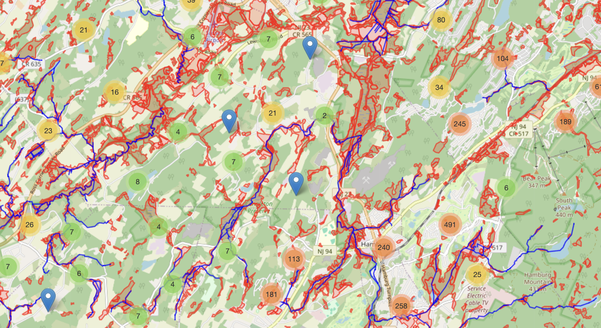
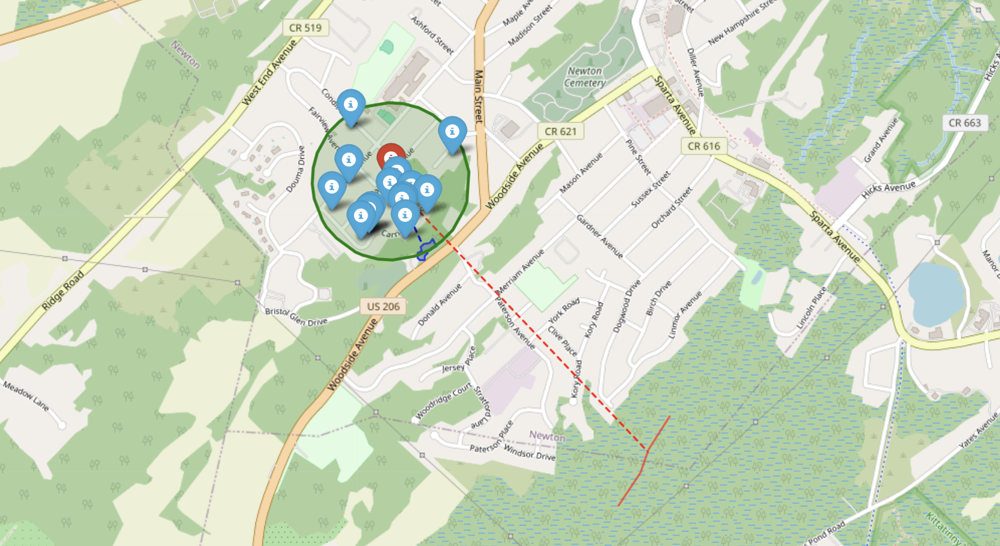

# Geospatial Data Processing and Visualization

This project provides a comprehensive toolkit for analyzing and visualizing geospatial data related to New Jersey counties. It includes the following core functionalities:

1. **Load and process geospatial data for a specific county**
2. **Analyze relationships between parcels, wetlands, and Category 1 (C1) waters**
3. **Visualize property listings with geographic overlays, such as wetlands and C1 waters**

The repository contains three main files:

- `County.py`
- `CountyGeoData.py`
- `FilterShowListings.ipynb`

### CountyGeoData.py
- **Purpose:** Handles geospatial relationships between parcels, wetlands, and Category 1 waters for a specified county.
- **Key Methods:**
  - `get_geo_data`: Determines relationships between parcels, wetlands, and C1 waters, and stores the results for future use.

### County.py
- **Purpose:** Provides tools for loading, analyzing, and visualizing geographic and property data for a specified county.
- **Key Methods:**
  - `get_county_polygon`: Loads the county boundary as a polygon from GeoJSON.
  - `get_parcel_data`: Processes parcel data into a geospatial format.
  - `get_wetland_data`: Retrieves and filters wetland data within the county boundary.
  - `get_c1_data`: Retrieves Category 1 water data.
  - `get_listing_data`: Processes property listings for visualization.
  - `show_county`: Generates an interactive map of the county with heatmaps and geographic overlays.
  - `show_listing`: Provides a detailed map view of a specific property, including nearby features.

### FilterShowListings.ipynb
- **Purpose:** A Jupyter Notebook that demonstrates the filtering and visualization of property listings.
- **Key Functionality:**
  - Filters property listings based on specific criteria.
  - Visualizes listings on an interactive map with proximity to wetlands and Category 1 waters.

## Requirements

To run this project, you need to install the following Python libraries:

- `pandas`: For data manipulation and analysis.
- `geopandas`: For geospatial data processing.
- `folium`: For interactive map generation and visualization.
- `shapely`: For geometric operations and analysis.
- `geopy`: For geodesic calculations.

